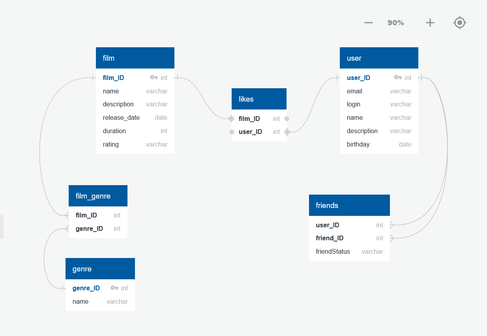

# java-filmorate
Template repository for Filmorate project.

Examples of requests:
POST {{baseUrl}}/films
body: {
"name": "New film",
"releaseDate": "1999-04-30",
"description": "New film about friends",
"duration": 120,
"rate": 4
}

GET {{baseUrl}}/films

PUT {{baseUrl}}/films
body: {
"id": 1,
"name": "Film Updated",
"releaseDate": "1989-04-17",
"description": "New film update decription",
"duration": 190,
"rate": 4
}

GET {{baseUrl}}/users/:id/friends/common/:otherId

PUT {{baseUrl}}/films/:id/like/:userId